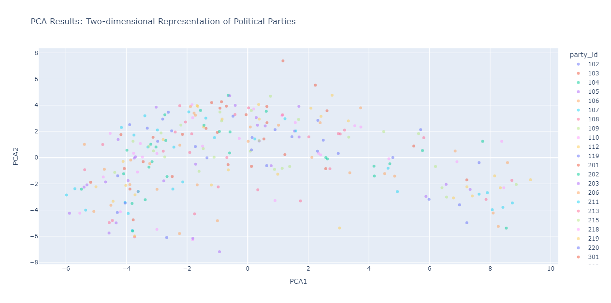
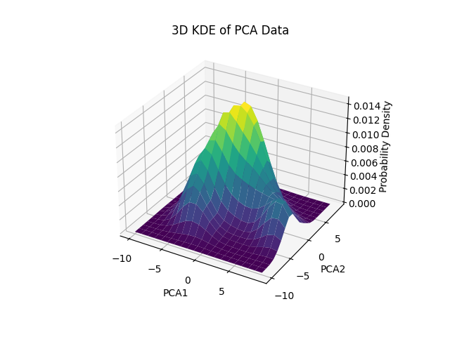
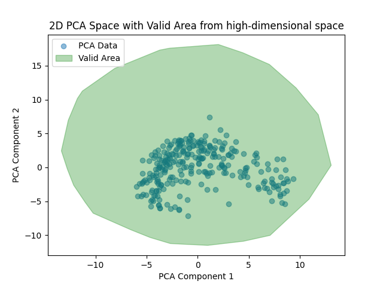

# Political Party PCA Dimensionality Reduction

## Overview
This project involves the analysis of 2019 Chapel Hill expert survey political party data using Python. It focuses on preprocessing, scaling, dimensionality reduction with PCA, generating new samples through statistical methods and painting the valid area from the high-dimensional space into 2D PCA-transformed space.

## Installation

Follow this guide to run the code locally using Docker.

### Prerequisites

- Ensure Git is installed on your system.
- Ensure Docker Desktop is installed and running on your system.

### Steps

1. Clone this repository: `git clone https://github.com/MikkoNaerhi/PoliticalPartyPCA-DimensionReduction.git`
2. Navigate to the repository directory: `cd PoliticalPartyPCA-DimensionReduction`
2. Initiate Docker on your computer. 
3. Build a Docker image from the Dockerfile: `docker build -t name .`
4. Run the Docker container: `docker run name`

## Data Loading and Preprocessing

Load data from CSV files and preprocess it accordingly to be used for further analysis.

Functions:
* `load_data`: Loads data from specified CSV files.
* `plot_missing_data_per_column`: Visualizes missing data in each column (see Figure "Missing Data per Column" below).
* `preprocess_expert_data`: Cleans and preprocesses expert data.
* `preprocess_party_data`: Preprocesses party data, selecting relevant columns.
* `aggregate_pol_parties`: Aggregates expert data by political party.

## Dimensionality Reduction with PCA

Scale features and perform PCA to reduce the dimensionality of the original high-dimensional data to two-dimensional data points. 

Functions:
* `scale_data`: Scales data using StandardScaler.
* `perform_PCA`: Performs PCA on scaled data and explains variance.
* `plot_PCA`: Plots PCA results for a visual representation.

### Results of dimensionality reduction with PCA

## Estimate the distribution of the 2D points and generate a random sample of 10 new political parties

Estimate the distribution of the 2D PCA-transformed data points using Gaussian Kernel Density Estimation and generate 10 new samples from the estimated distribution.

Functions:
* `generate_new_samples`: Generates new samples using Gaussian Kernel Density Estimation.

### Estimated distribution of the 2D points

## Map 2D random samples back to high-dimensional space

Map the generated 10 random samples from the previous task back to the original high-dimensional space. 

Functions: 
* `reverse_map_2d_to_high_dim`: Maps 2D PCA samples back to the original high-dimensional space.

## Plot the valid area of the high-dimensional space into 2D space

Plot an approximation of the valid area in the 2D PCA-transformed space. This is achieved with generating a large number of binary combinations which represent the extreme points of the value bounds of the original high-dimensional data. 

Functions:
* `plot_valid_area_2d`

### Valid area of the high-dimensional space in the 2D space

